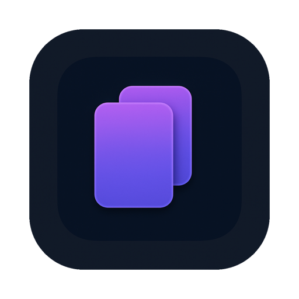
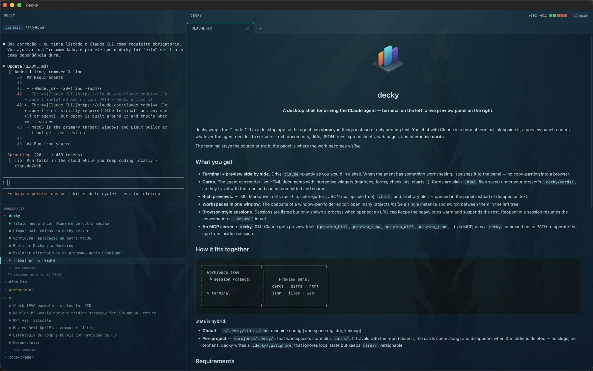
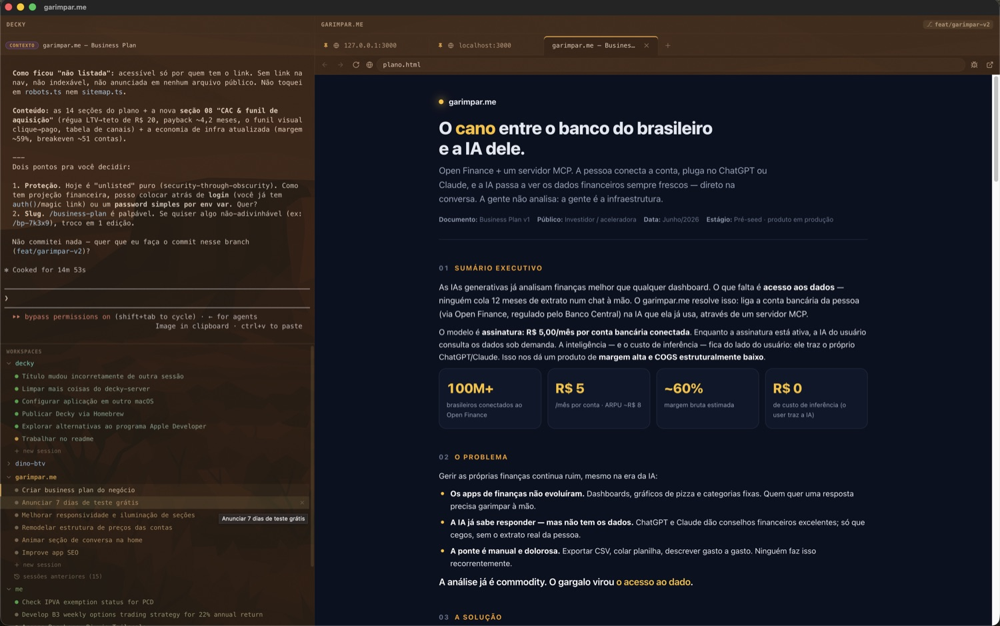
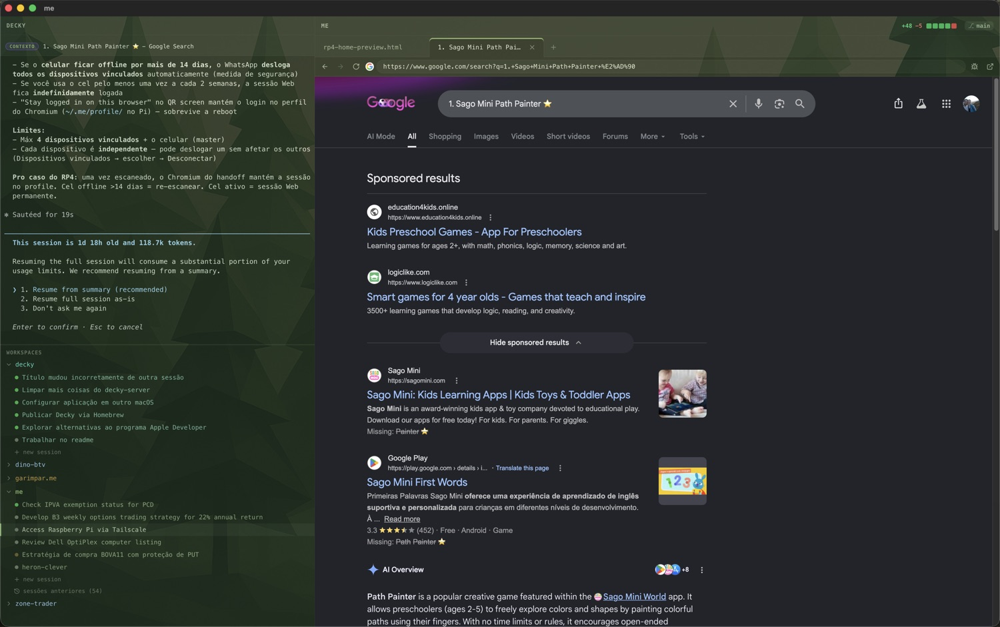

<div align="center">
  
  <h1>decky</h1>
  <p><strong>A desktop shell for driving the Claude agent — terminal on the left, a live preview panel on the right.</strong></p>
</div>

<p align="center">
  
</p>

---

decky wraps the [Claude](https://claude.com/claude-code) CLI in a desktop app so the agent can **show** you things instead of only printing text. You chat with Claude in a normal terminal; alongside it, a preview panel renders whatever the agent decides to surface — rich documents, diffs, JSON trees, spreadsheets, web pages, and interactive **cards**.

The terminal stays the source of truth; the panel is where the work becomes *visible*.

## What you get

- **Terminal + preview side by side.** Drive `claude` exactly as you would in a shell. When the agent has something worth seeing, it pushes it to the panel — no copy-pasting into a browser.
- **Cards.** The agent can render live HTML documents with interactive widgets (matrices, forms, checklists, charts…). Cards are plain `.html` files saved under your project's `.decky/cards/`, so they travel with the repo and can be committed and shared.
- **Rich previews.** HTML, Markdown, diffs (per-file, color-gutter), JSON (collapsible tree), `.xlsx`, and arbitrary files — opened in the panel instead of dumped as text.
- **Workspaces in one window.** The opposite of a window-per-folder editor: open many projects *inside* a single instance and switch between them in the left tree.
- **Browser-style sessions.** Sessions are listed but only spawn a process when opened; an LRU cap keeps the heavy ones warm and suspends the rest. Reopening a session resumes the conversation (`--resume`) intact.
- **An MCP server + `decky` CLI.** Claude gets preview tools (`preview_html`, `preview_show`, `preview_diff`, `preview_json`, …) via MCP, plus a `decky` command on its PATH to operate the app from inside a session.

## What it looks like

<table>
  <tr>
    <td width="50%" valign="top">
      
      <p align="center"><em>A card with live widgets — the agent builds a document you can actually read.</em></p>
    </td>
    <td width="50%" valign="top">
      
      <p align="center"><em>A web page in the panel — drive and inspect the browser without leaving decky.</em></p>
    </td>
  </tr>
</table>

## How it fits together

```
┌─────────────────────────┬───────────────────────────┐
│  Workspace tree          │                           │
│   └ session (claude)     │      Preview panel        │
│                          │   cards · diffs · html    │
│  > terminal              │   json · files · web      │
│                          │                           │
└─────────────────────────┴───────────────────────────┘
```

State is **hybrid**:

- **Global** — `~/.decky/state.json`: machine config (workspace registry, keymap).
- **Per-project** — `<project>/.decky/`: that workspace's state plus `cards/`. It travels with the repo (clone it, the cards come along) and disappears when the folder is deleted — no slugs, no orphans. decky writes a `.decky/.gitignore` that ignores local state but keeps `cards/` versionable.

## Requirements

- **Node.js** (20+) and **npm**
- The **[Claude CLI](https://claude.com/claude-code)** (`claude`) — not strictly required (the terminal runs any shell or agent), but decky is built around it and that's where it shines
- macOS is the primary target; Windows and Linux builds exist but get less testing

## Run from source

```bash
npm install
npm run dev
```

`npm run dev` launches an **isolated dev instance** (`~/.decky-dev`, its own MCP server and port) so it runs side by side with an installed `decky.app` without clobbering its state.

## Build

```bash
npm run build:mac     # macOS  (.dmg / .app)
npm run build:win     # Windows
npm run build:linux   # Linux
```

Other useful scripts:

| Script | What it does |
| --- | --- |
| `npm run typecheck` | Type-check the node + web sides |
| `npm run lint` | ESLint over the repo |
| `npm run format` | Prettier write |
| `npm run build:unpack` | Build an unpacked app dir (no installer) |

## The `decky` CLI

Inside a decky session, the `decky` command is on your PATH (and the agent's). It operates decky itself from the terminal — open tabs, create cards, drive web cards, inspect the session. The command set grows over time, so `decky help` is the source of truth:

```bash
decky help            # list commands
decky widgets         # the widget catalog + spec shapes
decky new-card        # create a card and open it
decky session         # show the current session context
```

## License

[Apache-2.0](LICENSE) © Daniel Kanczuk
