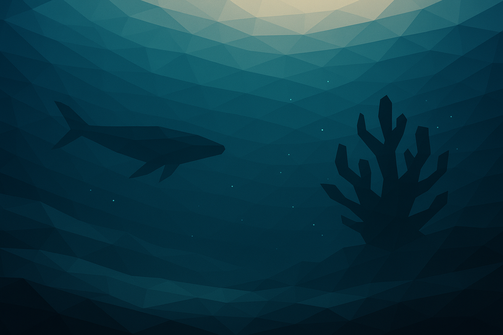
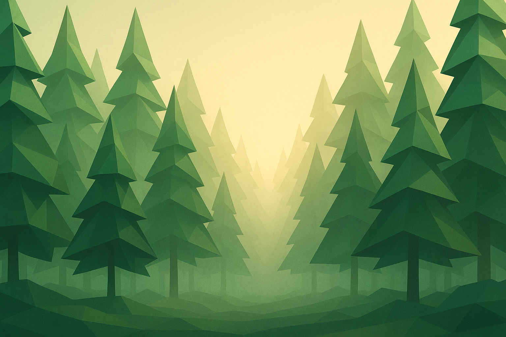
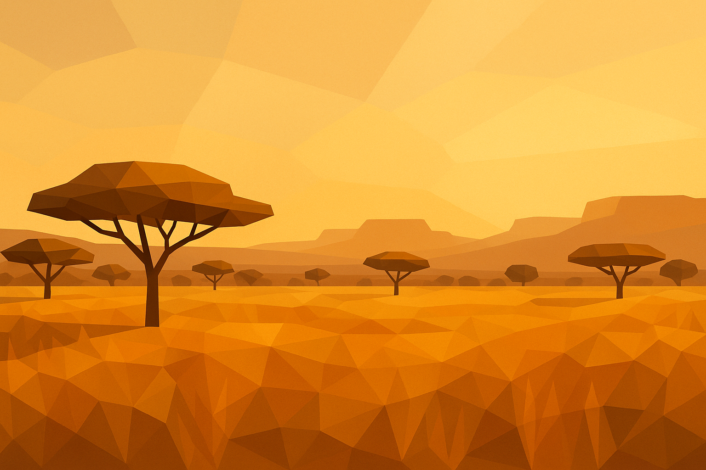
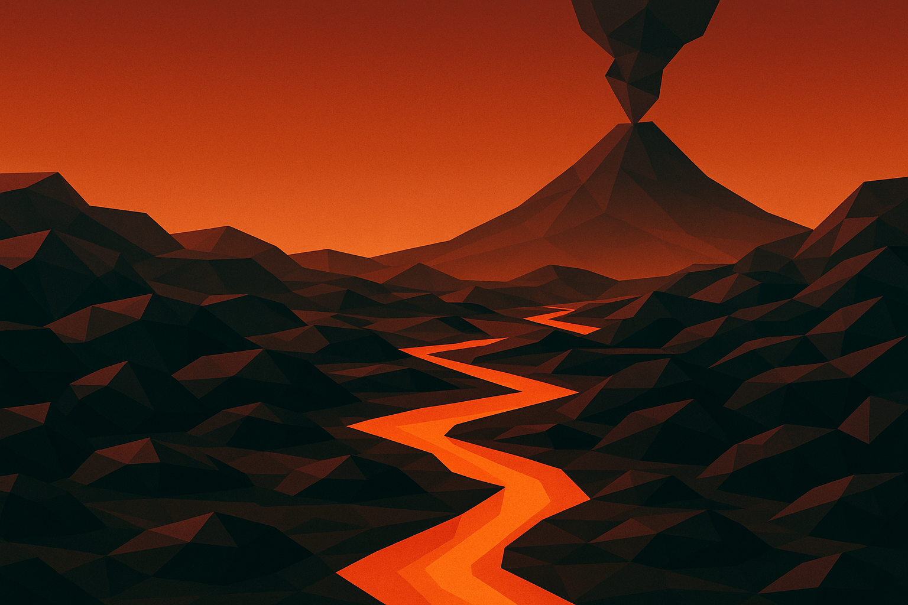

# Backgrounds low-poly — review v1

5 amostras geradas via `gpt-image-1` high (1536×1024), uma por tema.
Avalia: vibe geral, paleta, nível de "poluição visual", legibilidade como background.

---

## abissal — fundo do mar

## floresta

## cerrado — savana brasileira

## lava — vulcão

## geleira

